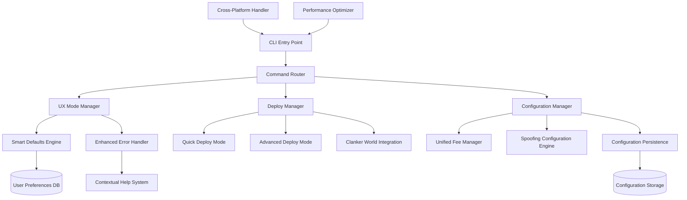

# Design Document: CLI User Experience Optimization

## Overview

The CLI User Experience Optimization system transforms the UMKM Terminal CLI into a highly efficient, user-friendly, and performant command-line interface. The system implements multiple UX modes, intelligent defaults, cross-platform compatibility, and streamlined deployment workflows while maintaining full integration with existing spoofing and fee management capabilities.

The design emphasizes performance through lazy loading and conditional imports, user experience through smart defaults and contextual error handling, and flexibility through configurable interaction modes and cross-platform support.

## Architecture

The system follows a modular architecture with clear separation of concerns:



## Components and Interfaces

### CLI Entry Point
The main entry point handles application initialization, performance optimization setup, and command routing.

```typescript
interface CLIEntryPoint {
  initialize(): Promise<void>
  setupPerformanceOptimizations(): void
  routeCommand(command: string, args: string[]): Promise<void>
  shutdown(): Promise<void>
}

interface PerformanceOptimizer {
  enableConditionalImports(): void
  setupLazyLoading(): void
  optimizeMemoryUsage(): void
  cacheFrequentlyUsedData(): void
}
```

### UX Mode Manager
Manages different user experience modes and their associated interaction patterns.

```typescript
enum UXMode {
  NORMAL = 'normal',
  FAST = 'fast',
  ULTRA = 'ultra',
  EXPERT = 'expert'
}

interface UXModeManager {
  getCurrentMode(): UXMode
  setMode(mode: UXMode): Promise<void>
  getConfirmationLevel(): ConfirmationLevel
  shouldShowPrompt(promptType: PromptType): boolean
  applyModeSettings(mode: UXMode): void
}

interface ConfirmationLevel {
  requiresConfirmation: boolean
  showDetailedPrompts: boolean
  enableSmartDefaults: boolean
  minimizeOutput: boolean
}
```

### Deploy Manager
Orchestrates both Quick Deploy and Advanced Deploy modes with optimized workflows.

```typescript
interface DeployManager {
  quickDeploy(options: QuickDeployOptions): Promise<DeployResult>
  advancedDeploy(options: AdvancedDeployOptions): Promise<DeployResult>
  validateDeployment(deployment: Deployment): Promise<ValidationResult>
}

interface QuickDeployOptions {
  tokenName: string
  symbol?: string // Auto-generated if not provided
  useSmartDefaults: boolean
  maxDuration: number // 30 seconds
}

interface AdvancedDeployOptions {
  tokenName: string
  symbol: string
  customConfiguration: DeployConfiguration
  validationLevel: ValidationLevel
}

interface DeployResult {
  success: boolean
  deploymentId: string
  essentialInfo: EssentialDeploymentInfo
  duration: number
  clankerVerification?: ClankerVerificationResult
}
```

### Smart Defaults Engine
Learns from user behavior and provides intelligent default values.

```typescript
interface SmartDefaultsEngine {
  recordUserChoice(context: string, choice: any): Promise<void>
  getSuggestedDefault(context: string): Promise<any>
  analyzeUsagePatterns(): Promise<UsagePattern[]>
  updateRecommendations(patterns: UsagePattern[]): Promise<void>
  getContextualDefaults(deploymentContext: DeploymentContext): Promise<DefaultValues>
}

interface UsagePattern {
  context: string
  frequency: number
  lastUsed: Date
  value: any
  confidence: number
}

interface DefaultValues {
  feePercentage: number
  deploymentMode: string
  validationLevel: ValidationLevel
  platformOptimizations: PlatformSettings
}
```

### Cross-Platform Handler
Ensures consistent behavior across different operating systems and environments.

```typescript
interface CrossPlatformHandler {
  detectPlatform(): Platform
  applyPlatformOptimizations(platform: Platform): void
  handlePlatformSpecificBehaviors(): void
  ensureCommandCompatibility(): void
  optimizeForEnvironment(environment: Environment): void
}

enum Platform {
  WINDOWS = 'windows',
  MAC = 'mac',
  LINUX = 'linux',
  WSL = 'wsl',
  TERMUX = 'termux'
}

interface PlatformSettings {
  pathSeparator: string
  commandPrefix: string
  environmentVariables: Record<string, string>
  terminalCapabilities: TerminalCapabilities
}
```

### Enhanced Error Handler
Provides contextual error messages with actionable suggestions.

```typescript
interface EnhancedErrorHandler {
  handleError(error: CLIError): Promise<ErrorResponse>
  categorizeError(error: Error): ErrorCategory
  generateSuggestions(error: CLIError): Suggestion[]
  offerRecoveryOptions(error: CLIError): RecoveryOption[]
  logErrorWithContext(error: CLIError, context: ErrorContext): void
}

interface CLIError extends Error {
  category: ErrorCategory
  context: ErrorContext
  recoverable: boolean
  suggestions: Suggestion[]
}

enum ErrorCategory {
  CONFIGURATION = 'configuration',
  NETWORK = 'network',
  VALIDATION = 'validation',
  SYSTEM = 'system',
  USER_INPUT = 'user_input'
}

interface Suggestion {
  description: string
  action: string
  likelihood: number
  automated: boolean
}
```

### Unified Fee Manager
Manages fee configuration with a single percentage for both Token and WETH.

```typescript
interface UnifiedFeeManager {
  setFeePercentage(percentage: number): Promise<void>
  getFeeConfiguration(): Promise<FeeConfiguration>
  calculateFees(amount: number, strategy: FeeStrategy): Promise<FeeCalculation>
  previewFees(amount: number, strategy: FeeStrategy): FeePreview
  getAvailableStrategies(): FeeStrategy[]
}

interface FeeConfiguration {
  percentage: number
  strategy: FeeStrategy
  appliesTo: ['TOKEN', 'WETH']
  lastModified: Date
}

enum FeeStrategy {
  DYNAMIC = 'dynamic', // 1-5% based on market volatility
  FLAT = 'flat',       // 3% fixed
  CUSTOM = 'custom'    // 1-99% manual
}

interface FeeCalculation {
  originalAmount: number
  feeAmount: number
  finalAmount: number
  strategy: FeeStrategy
  percentage: number
}
```

### Spoofing Configuration Engine
Manages reward distribution configurations with real-time updates.

```typescript
interface SpoofingConfigurationEngine {
  setDistributionStrategy(strategy: DistributionStrategy): Promise<void>
  getCurrentConfiguration(): Promise<SpoofingConfiguration>
  applyRealtimeChanges(changes: ConfigurationChanges): Promise<void>
  getAvailableStrategies(): DistributionStrategy[]
  validateConfiguration(config: SpoofingConfiguration): ValidationResult
}

interface SpoofingConfiguration {
  adminAllocation: number    // 0.1%
  recipientAllocation: number // 99.9%
  strategy: DistributionStrategy
  realTimeUpdates: boolean
  integrationMode: IntegrationMode
}

interface DistributionStrategy {
  id: string
  name: string
  adminPercentage: number
  recipientPercentage: number
  description: string
}
```

### Clanker World Integration
Optimizes verification processes with the Clanker World system.

```typescript
interface ClankerWorldIntegration {
  optimizeVerification(deployment: Deployment): Promise<VerificationResult>
  reduceValidationOverhead(): void
  cacheVerificationResults(result: VerificationResult): Promise<void>
  handleVerificationFailure(error: VerificationError): Promise<RetryResult>
  getEssentialVerificationInfo(result: VerificationResult): EssentialInfo
}

interface VerificationResult {
  verified: boolean
  verificationId: string
  timestamp: Date
  essentialInfo: EssentialInfo
  cached: boolean
}

interface EssentialInfo {
  status: string
  deploymentHash: string
  networkConfirmation: boolean
  estimatedTime: number
}
```

## Data Models

### User Preferences Model
```typescript
interface UserPreferences {
  userId: string
  uxMode: UXMode
  defaultFeeStrategy: FeeStrategy
  preferredDeployMode: DeployMode
  smartDefaultsEnabled: boolean
  platformOptimizations: PlatformSettings
  usageHistory: UsageHistoryEntry[]
  lastUpdated: Date
}

interface UsageHistoryEntry {
  action: string
  context: string
  value: any
  timestamp: Date
  frequency: number
}
```

### Configuration Storage Model
```typescript
interface ConfigurationStorage {
  globalSettings: GlobalSettings
  userProfiles: UserProfile[]
  feeConfigurations: FeeConfiguration[]
  spoofingConfigurations: SpoofingConfiguration[]
  deploymentTemplates: DeploymentTemplate[]
  cacheData: CacheEntry[]
}

interface GlobalSettings {
  version: string
  defaultUXMode: UXMode
  performanceOptimizations: boolean
  crossPlatformMode: boolean
  errorReportingEnabled: boolean
}
```

### Deployment Context Model
```typescript
interface DeploymentContext {
  mode: DeployMode
  platform: Platform
  userExperience: UXMode
  previousDeployments: DeploymentHistory[]
  currentConfiguration: DeployConfiguration
  timeConstraints: TimeConstraints
}

interface DeployConfiguration {
  tokenName: string
  symbol: string
  feeConfiguration: FeeConfiguration
  spoofingConfiguration: SpoofingConfiguration
  validationLevel: ValidationLevel
  clankerIntegration: boolean
}
```

## Correctness Properties

*A property is a characteristic or behavior that should hold true across all valid executions of a system-essentially, a formal statement about what the system should do. Properties serve as the bridge between human-readable specifications and machine-verifiable correctness guarantees.*

Before defining the correctness properties, I need to analyze the acceptance criteria to determine which ones are testable as properties.

Based on the prework analysis, I'll now define the key correctness properties that validate the system's behavior:

### Property 1: UX Mode Behavior Consistency
*For any* UX mode (normal/fast/ultra/expert) and any CLI operation, the system should apply the appropriate interaction patterns consistently - normal mode provides standard prompts, fast mode reduces confirmations, ultra mode minimizes prompts with smart defaults, and expert mode provides direct access with minimal overhead.
**Validates: Requirements 1.1, 1.2, 1.3, 1.4**

### Property 2: Mode Persistence and Switching
*For any* UX mode selection, the system should persist the mode across sessions and immediately apply new interaction patterns when switching modes.
**Validates: Requirements 1.5, 1.6**

### Property 3: Quick Deploy Time Constraint
*For any* valid Quick Deploy operation, the system should complete the entire deployment process within 30 seconds while applying smart defaults and providing essential information only.
**Validates: Requirements 2.1, 2.3, 2.4**

### Property 4: Symbol Auto-Generation
*For any* token name provided without a symbol in Quick Deploy mode, the system should auto-generate a symbol based on the token name.
**Validates: Requirements 2.2**

### Property 5: Quick Deploy Optimization and Error Handling
*For any* Quick Deploy operation, the system should optimize Clanker World verification for speed and provide contextual suggestions when errors occur.
**Validates: Requirements 2.5, 2.6**

### Property 6: Advanced Deploy Structure
*For any* Advanced Deploy operation, the system should complete the process in exactly 4 steps while using smart defaults for validations and providing comprehensive deployment summary.
**Validates: Requirements 3.1, 3.2, 3.5**

### Property 7: Configuration Organization and Validation Optimization
*For any* configuration presentation in Advanced Deploy, the system should group related settings logically and reduce verbose validations while maintaining deployment integrity.
**Validates: Requirements 3.3, 3.4**

### Property 8: Smart Defaults Learning and Adaptation
*For any* user configuration choice, the system should record usage patterns, suggest previously used values as defaults, and adapt recommendations based on context and preference changes.
**Validates: Requirements 4.1, 4.2, 4.4, 4.5**

### Property 9: Smart Defaults Fallback and Persistence
*For any* scenario where no user history exists, the system should provide sensible defaults, and all learned preferences should persist across CLI sessions.
**Validates: Requirements 4.3, 4.6**

### Property 10: Cross-Platform Feature Compatibility
*For any* platform (Windows, Mac, Linux, WSL, Termux), the system should ensure full feature compatibility with platform-specific optimizations while maintaining consistent command syntax.
**Validates: Requirements 5.1, 5.2, 5.3, 5.4, 5.5, 5.6**

### Property 11: Cross-Platform Functionality Preservation
*For any* platform-specific optimization applied, the system should preserve core functionality across all platforms.
**Validates: Requirements 5.7**

### Property 12: Contextual Error Handling
*For any* error that occurs, the system should provide contextual error messages with specific details, suggested resolution steps ranked by likelihood of success, and proper error categorization.
**Validates: Requirements 6.1, 6.2, 6.3, 6.4**

### Property 13: Error Recovery and Progress Preservation
*For any* recoverable error, the system should offer automatic retry mechanisms, and for critical errors, preserve user progress while offering recovery options.
**Validates: Requirements 6.5, 6.6**

### Property 14: Performance Optimization - Startup and Loading
*For any* CLI startup, the system should use conditional imports to reduce load time, implement lazy loading for non-essential components, and cache frequently accessed configuration data.
**Validates: Requirements 7.1, 7.2, 7.3**

### Property 15: Performance Optimization - Runtime Efficiency
*For any* operation, the system should optimize resource usage and memory allocation, minimize network calls through intelligent batching, and manage background processes without blocking user interaction.
**Validates: Requirements 7.4, 7.5, 7.6**

### Property 16: Unified Fee Configuration
*For any* fee configuration, the system should accept a single percentage value that applies to both Token and WETH, and use this unified structure consistently across all operations.
**Validates: Requirements 8.1, 8.7**

### Property 17: Fee Strategy Support
*For any* fee strategy (Dynamic 1-5%, Flat 3%, Custom 1-99%), the system should support the strategy with real-time preview calculations and maintain an interactive configuration menu.
**Validates: Requirements 8.2, 8.3, 8.4, 8.5, 8.6**

### Property 18: Spoofing Distribution Configuration
*For any* spoofing configuration, the system should support reversed reward distribution (Admin: 0.1%, Recipients: 99.9%) with exactly 4 distinct distribution strategies and real-time configuration changes.
**Validates: Requirements 9.1, 9.2, 9.3**

### Property 19: Spoofing Integration and Compatibility
*For any* spoofing operation, the system should maintain an interactive configuration menu, integrate seamlessly with existing features, and maintain 99.9% admin rewards compatibility.
**Validates: Requirements 9.4, 9.5, 9.6**

### Property 20: Clanker World Verification Optimization
*For any* Clanker World verification, the system should optimize the process for speed, reduce validations while maintaining integrity, display only essential information, and handle API interactions efficiently.
**Validates: Requirements 10.1, 10.2, 10.3, 10.4**

### Property 21: Clanker World Failure Handling and Caching
*For any* verification failure, the system should provide clear feedback and retry options, and cache verification results when appropriate to avoid redundant checks.
**Validates: Requirements 10.5, 10.6**

### Property 22: Configuration Persistence and Management
*For any* user configuration, the system should persist across sessions, save changes immediately, provide export/import capabilities, and validate integrity on startup.
**Validates: Requirements 11.1, 11.2, 11.3, 11.5**

### Property 23: Configuration Conflict Resolution and Profiles
*For any* configuration conflict, the system should provide resolution options, and support multiple configuration profiles for different use cases.
**Validates: Requirements 11.4, 11.6**

### Property 24: Interactive Menu Functionality
*For any* configuration menu, the system should provide clear navigation, keyboard shortcuts, contextual help, consistent styling, immediate feedback, and menu history with quick access to recent options.
**Validates: Requirements 12.1, 12.2, 12.3, 12.4, 12.5, 12.6**

## Error Handling

The system implements comprehensive error handling with contextual guidance:

### Error Categories and Handling Strategies

1. **Configuration Errors**
   - Invalid UX mode selections
   - Malformed fee percentages
   - Corrupted configuration files
   - Strategy: Provide specific validation messages with correction suggestions

2. **Network Errors**
   - Clanker World API failures
   - Timeout during verification
   - Connection issues during deployment
   - Strategy: Implement retry mechanisms with exponential backoff

3. **Validation Errors**
   - Invalid token names or symbols
   - Out-of-range fee percentages
   - Incompatible platform configurations
   - Strategy: Offer smart defaults and guided correction

4. **System Errors**
   - Platform compatibility issues
   - Memory allocation failures
   - File system access problems
   - Strategy: Graceful degradation with alternative approaches

5. **User Input Errors**
   - Invalid command syntax
   - Missing required parameters
   - Conflicting option combinations
   - Strategy: Interactive correction with contextual help

### Recovery Mechanisms

- **Automatic Retry**: For transient network and system errors
- **Progress Preservation**: Save user progress before critical operations
- **Rollback Capability**: Undo configuration changes that cause errors
- **Alternative Paths**: Provide fallback options when primary methods fail
- **Contextual Suggestions**: Rank resolution options by success probability

## Testing Strategy

The testing strategy employs a dual approach combining unit tests for specific scenarios and property-based tests for comprehensive validation:

### Unit Testing Approach

Unit tests focus on:
- **Specific Examples**: Test concrete scenarios like "Quick Deploy with token name 'MyToken' generates symbol 'MT'"
- **Edge Cases**: Test boundary conditions like 1% and 99% fee configurations
- **Error Conditions**: Test specific error scenarios and their expected responses
- **Integration Points**: Test interactions between components like UX Mode Manager and Deploy Manager
- **Platform-Specific Behaviors**: Test specific optimizations for each supported platform

### Property-Based Testing Configuration

Property-based tests validate universal properties using **fast-check** (JavaScript/TypeScript) library:

- **Minimum 100 iterations** per property test to ensure comprehensive input coverage
- **Custom generators** for CLI commands, configuration objects, and deployment scenarios
- **Shrinking capabilities** to find minimal failing examples when tests fail
- **Tagged tests** referencing design document properties

Each property test must include a comment tag in the format:
**Feature: cli-user-experience-optimization, Property {number}: {property_text}**

### Test Categories and Coverage

1. **UX Mode Testing**
   - Property tests for mode consistency across all operations
   - Unit tests for specific mode transitions and behaviors

2. **Performance Testing**
   - Property tests for startup time constraints and resource usage
   - Unit tests for specific optimization scenarios

3. **Cross-Platform Testing**
   - Property tests for feature consistency across platforms
   - Unit tests for platform-specific optimizations

4. **Configuration Testing**
   - Property tests for persistence and consistency
   - Unit tests for specific configuration scenarios

5. **Error Handling Testing**
   - Property tests for error categorization and suggestion ranking
   - Unit tests for specific error recovery scenarios

### Testing Tools and Framework

- **Primary Framework**: Jest for JavaScript/TypeScript testing
- **Property Testing**: fast-check library for property-based testing
- **Mocking**: Jest mocks for external dependencies (Clanker World API, file system)
- **Coverage**: Minimum 90% code coverage with focus on critical paths
- **CI/CD Integration**: Automated testing on all supported platforms

### Test Data Management

- **Generated Test Data**: Use property-based testing generators for comprehensive input coverage
- **Fixture Data**: Maintain realistic configuration examples for unit tests
- **Mock Services**: Simulate Clanker World API responses for consistent testing
- **Platform Simulation**: Mock platform-specific behaviors for cross-platform testing

The testing strategy ensures that both specific use cases and general system properties are thoroughly validated, providing confidence in the system's correctness and reliability across all supported scenarios and platforms.