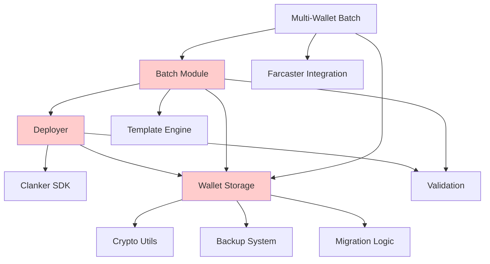
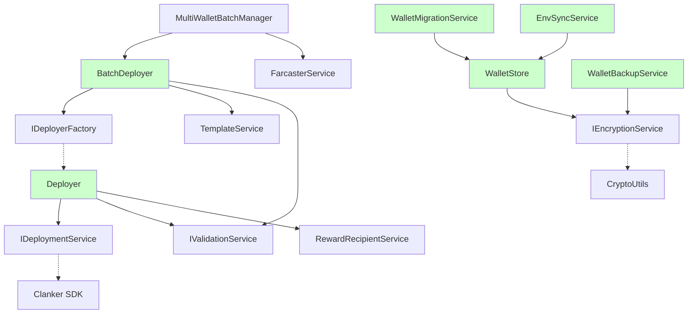

# Design Document: UMKM Terminal Codebase Refactoring

## Overview

This design document outlines the comprehensive refactoring of the UMKM Terminal codebase to address technical debt, improve maintainability, and enhance code quality. The refactoring will be performed in phases to minimize risk while delivering incremental improvements.

The refactoring focuses on five key areas:
1. **Code Duplication Elimination** - Extract shared utilities and patterns
2. **Function Simplification** - Break down complex methods into focused, testable units
3. **Module Reorganization** - Improve separation of concerns and file organization
4. **Coupling Reduction** - Introduce dependency injection and clear interfaces
5. **Error Handling Standardization** - Establish consistent error patterns across the codebase

All changes will maintain 100% backward compatibility with existing public APIs while improving internal structure and maintainability.

## Architecture

### Current Architecture Issues

The current codebase exhibits several architectural challenges:



**Issues:**
- **Red components** have multiple responsibilities and are tightly coupled
- Validation logic is duplicated across Deployer, Batch, and Wallet modules
- Reward recipient processing is duplicated in Deployer and Batch
- Wallet Storage handles too many concerns (storage, backup, migration, env sync)

### Target Architecture

The refactored architecture will introduce clear separation of concerns and dependency injection:



**Improvements:**
- **Green components** have single responsibilities
- Interfaces (I-prefixed) enable dependency injection and testing
- Services are focused and reusable
- Clear data flow with minimal coupling

## Components and Interfaces

### 1. Validation Service

**Purpose:** Centralize validation logic and eliminate duplication

```typescript
interface IValidationService {
  validatePrivateKey(privateKey: string): ValidationResult<PrivateKeyInfo>;
  validateMnemonic(mnemonic: string): ValidationResult<MnemonicInfo>;
  validateAddress(address: string): ValidationResult<AddressInfo>;
  validateTokenConfig(config: TokenConfig): ValidationResult<TokenConfig>;
}

class ValidationService implements IValidationService {
  validatePrivateKey(privateKey: string): ValidationResult<PrivateKeyInfo> {
    // Centralized validation logic
    // Returns normalized key, address, and validation status
  }
}

// Helper function for common pattern
function validatePrivateKeyOrThrow(
  privateKey: string, 
  context?: string
): PrivateKeyInfo {
  const result = validationService.validatePrivateKey(privateKey);
  if (!result.success) {
    throw new ValidationError('INVALID_PRIVATE_KEY', result.error, { context });
  }
  return result.data;
}
```

### 2. Reward Recipient Service

**Purpose:** Eliminate duplication in reward recipient processing

```typescript
interface RewardRecipientConfig {
  address: string;
  allocation?: number;
  percentage?: number;
}

interface NormalizedRewardRecipient {
  address: string;
  allocation: number;
}

class RewardRecipientService {
  normalize(
    recipients: RewardRecipientConfig[],
    defaultRecipient?: string
  ): NormalizedRewardRecipient[] {
    // Shared logic for both batch and deployer
    // Handle missing allocations, distribute remaining percentages
    // Validate total allocation = 100%
  }
  
  validate(recipients: NormalizedRewardRecipient[]): ValidationResult<void> {
    // Validate addresses, allocation totals, etc.
  }
}
```

### 3. Wallet Store Transaction Pattern

**Purpose:** Simplify wallet operations with consistent patterns

```typescript
class WalletStoreTransaction {
  private store: WalletStore;
  private modified = false;
  
  static async begin(): Promise<WalletStoreTransaction> {
    const transaction = new WalletStoreTransaction();
    await transaction.load();
    return transaction;
  }
  
  findWallet(address: string): StoredWallet | null {
    return this.store.wallets.find(w => w.address === address) || null;
  }
  
  addWallet(wallet: StoredWallet): this {
    this.store.wallets.push(wallet);
    this.modified = true;
    return this;
  }
  
  updateWallet(address: string, updates: Partial<StoredWallet>): this {
    const wallet = this.findWallet(address);
    if (wallet) {
      Object.assign(wallet, updates);
      this.modified = true;
    }
    return this;
  }
  
  async commit(): Promise<boolean> {
    if (this.modified) {
      return await saveWalletStore(this.store);
    }
    return true;
  }
  
  async commitAndSync(privateKey?: string): Promise<boolean> {
    const success = await this.commit();
    if (success && privateKey) {
      await syncActiveWalletToEnv(privateKey);
    }
    return success;
  }
}

// Usage example
async function addWalletToStore(wallet: StoredWallet): Promise<WalletOperationResult> {
  try {
    const transaction = await WalletStoreTransaction.begin();
    const existing = transaction.findWallet(wallet.address);
    
    if (existing) {
      return { success: false, error: 'Wallet already exists' };
    }
    
    transaction.addWallet(wallet);
    const success = await transaction.commit();
    
    return { success, wallet: success ? wallet : undefined };
  } catch (error) {
    return { success: false, error: error.message };
  }
}
```

### 4. Simplified Deployer Class

**Purpose:** Break down the complex deploy() method into focused sub-methods

```typescript
class Deployer {
  constructor(
    private config: ClankerEnvConfig,
    private deploymentService: IDeploymentService,
    private validationService: IValidationService,
    private rewardService: RewardRecipientService
  ) {}
  
  async deploy(config: SimpleDeployConfig): Promise<DeployOutput> {
    // Orchestrate the deployment process
    const validatedConfig = await this.validateDeployConfig(config);
    const tokenConfig = await this.buildTokenConfig(validatedConfig);
    const result = await this.deploymentService.deploy(tokenConfig);
    return this.formatDeployOutput(result);
  }
  
  private async validateDeployConfig(config: SimpleDeployConfig): Promise<SimpleDeployConfig> {
    // Validate all aspects of the configuration
    this.validationService.validateTokenConfig(config);
    if (config.rewardRecipients) {
      this.rewardService.validate(config.rewardRecipients);
    }
    return config;
  }
  
  private async buildTokenConfig(config: SimpleDeployConfig): Promise<ClankerTokenV4> {
    const rewardConfig = this.buildRewardConfig(config);
    const feeConfig = this.buildFeeConfig(config);
    const vaultConfig = this.buildVaultConfig(config);
    const mevConfig = this.buildMevConfig(config);
    
    return {
      name: config.name,
      symbol: config.symbol,
      image: config.image,
      tokenAdmin: config.tokenAdmin,
      chainId: config.chainId,
      rewards: rewardConfig,
      fees: feeConfig,
      vault: vaultConfig,
      mev: mevConfig,
      metadata: this.encodeMetadata(config)
    };
  }
  
  private buildRewardConfig(config: SimpleDeployConfig): RewardsConfig | undefined {
    if (!config.rewardRecipients) return undefined;
    
    const normalized = this.rewardService.normalize(
      config.rewardRecipients,
      config.tokenAdmin
    );
    
    return {
      recipients: normalized.map(r => ({
        recipient: r.address,
        allocation: r.allocation
      }))
    };
  }
  
  private buildFeeConfig(config: SimpleDeployConfig): FeeConfig {
    // Extract fee configuration logic
  }
  
  private buildVaultConfig(config: SimpleDeployConfig): VaultConfig | undefined {
    // Extract vault configuration logic
  }
  
  private buildMevConfig(config: SimpleDeployConfig): MevConfig | undefined {
    // Extract MEV configuration logic
  }
}
```

### 5. Batch Deployment Refactoring

**Purpose:** Separate template management from deployment execution

```typescript
// Template Service
class TemplateService {
  async loadTemplate(filePath: string): Promise<BatchTemplate> {
    // Template loading logic
  }
  
  validateTemplate(template: BatchTemplate): ValidationResult<BatchTemplate> {
    // Template validation logic
  }
  
  generateTemplate(options: GenerateOptions): BatchTemplate {
    // Template generation logic
  }
  
  saveTemplate(template: BatchTemplate, filePath: string): Promise<void> {
    // Template saving logic
  }
}

// Batch Deployer
class BatchDeployer {
  constructor(
    private template: BatchTemplate,
    private deployerFactory: IDeployerFactory,
    private options: BatchOptions = {}
  ) {}
  
  async deploy(): Promise<BatchSummary> {
    const results: BatchResult[] = [];
    const startTime = Date.now();
    
    for (let i = 0; i < this.template.tokens.length; i++) {
      const result = await this.deployToken(this.template.tokens[i], i);
      results.push(result);
      
      if (this.options.onProgress) {
        this.options.onProgress(i + 1, this.template.tokens.length, result);
      }
      
      if (i < this.template.tokens.length - 1) {
        await this.delay();
      }
    }
    
    return this.createSummary(results, Date.now() - startTime);
  }
  
  private async deployToken(token: BatchToken, index: number): Promise<BatchResult> {
    try {
      const deployer = this.deployerFactory.create(token.chainId);
      const config = this.buildDeployConfig(token, index);
      const result = await deployer.deploy(config);
      
      return {
        success: true,
        token: token,
        result: result,
        index: index
      };
    } catch (error) {
      return {
        success: false,
        token: token,
        error: error.message,
        index: index
      };
    }
  }
  
  private buildDeployConfig(token: BatchToken, index: number): SimpleDeployConfig {
    // Build configuration from template token and defaults
  }
  
  private delay(): Promise<void> {
    const delayMs = this.options.delayBetweenDeploys || 1000;
    return new Promise(resolve => setTimeout(resolve, delayMs));
  }
}

// Updated main function
async function deployTemplate(
  template: BatchTemplate,
  options: BatchOptions = {},
  deployerFactory: IDeployerFactory = defaultDeployerFactory
): Promise<BatchSummary> {
  const templateService = new TemplateService();
  const validationResult = templateService.validateTemplate(template);
  
  if (!validationResult.success) {
    throw new ValidationError('INVALID_TEMPLATE', validationResult.error);
  }
  
  const deployer = new BatchDeployer(template, deployerFactory, options);
  return await deployer.deploy();
}
```

### 6. Module Reorganization

**Purpose:** Improve separation of concerns and file organization

#### Batch Module Structure
```
src/batch/
├── template-service.ts      # Template management (load, save, validate, generate)
├── batch-deployer.ts        # Single-wallet batch deployment
├── concurrent-deployer.ts   # Concurrent deployment with worker pool
├── multi-wallet-manager.ts  # Multi-wallet orchestration
├── farcaster-integration.ts # Farcaster-specific logic
└── index.ts                 # Public API exports
```

#### Wallet Module Structure
```
src/wallet/
├── store.ts                 # Multi-wallet store operations
├── encryption-service.ts    # Encryption interface and implementation
├── backup-service.ts        # Backup file operations
├── migration-service.ts     # Legacy migration logic
├── env-sync-service.ts      # .env synchronization
├── menu.ts                  # Interactive UI (unchanged)
├── types.ts                 # Types (unchanged)
└── index.ts                 # Public API exports
```

#### Deployer Module Structure
```
src/deployer/
├── deployer.ts              # Core Deployer class
├── simple-deployer.ts       # SimpleDeployConfig handling
├── multi-chain-deployer.ts  # MultiChainDeployer
├── deployment-service.ts    # IDeploymentService interface
├── factory.ts               # Factory functions
├── nonce-manager.ts         # Nonce tracking (unchanged)
└── index.ts                 # Public API exports
```

## Data Models

### Validation Result Type

```typescript
type ValidationResult<T> = {
  success: true;
  data: T;
} | {
  success: false;
  error: string;
  details?: Record<string, unknown>;
};
```

### Error Context Type

```typescript
interface ErrorContext {
  operation?: string;
  component?: string;
  tokenIndex?: number;
  walletAddress?: string;
  chainId?: number;
  [key: string]: unknown;
}

class ClankerError extends Error {
  constructor(
    public code: string,
    message: string,
    public context?: ErrorContext
  ) {
    super(message);
    this.name = 'ClankerError';
  }
}
```

### Service Interfaces

```typescript
interface IDeploymentService {
  deploy(config: ClankerTokenV4): Promise<DeployResult>;
  getAvailableFees(tokenAddress: string, recipient: string): Promise<bigint>;
  claimFees(tokenAddress: string, recipient: string): Promise<string>;
}

interface IEncryptionService {
  encrypt(plaintext: string, password: string): Promise<string>;
  decrypt(encrypted: string, password: string): Promise<string>;
  generateSalt(): string;
}

interface IDeployerFactory {
  create(chainId: number): Deployer;
  createMultiChain(configs: MultiChainConfig[]): MultiChainDeployer;
}
```

## Correctness Properties

*A property is a characteristic or behavior that should hold true across all valid executions of a system—essentially, a formal statement about what the system should do. Properties serve as the bridge between human-readable specifications and machine-verifiable correctness guarantees.*

### Property 1: Validation Consistency
*For any* input requiring validation, using the validation service should produce identical results regardless of which module calls it
**Validates: Requirements 1.1, 1.5**

### Property 2: Reward Recipient Processing Equivalence
*For any* reward recipient configuration, the batch module and deployer module should produce identical normalized results when processing the same input
**Validates: Requirements 1.2**

### Property 3: Wallet Transaction Pattern Consistency
*For any* wallet store operation, using the transaction pattern should ensure consistent error handling and state management across all wallet operations
**Validates: Requirements 1.3**

### Property 4: Dependency Injection Compliance
*For any* component that accepts dependencies, it should be able to work with any implementation that satisfies the interface contract
**Validates: Requirements 4.1, 4.2, 4.3, 4.5**

### Property 5: Mock Compatibility
*For any* interface defined in the system, it should be possible to create mock implementations that allow components to function correctly in tests
**Validates: Requirements 4.4, 7.5**

### Property 6: Error Structure Consistency
*For any* error thrown by async operations, it should have the same type structure and include consistent context information
**Validates: Requirements 5.1, 5.4, 5.5**

### Property 7: Result Type Consistency
*For any* sync operation that can fail, it should return a Result<T, E> type with consistent success/error structure
**Validates: Requirements 5.2**

### Property 8: UI Error Response Consistency
*For any* UI operation that can fail, it should return an object with consistent success/error structure for user feedback
**Validates: Requirements 5.3**

### Property 9: API Backward Compatibility
*For any* existing public API method, it should maintain the same signature and produce equivalent results after refactoring
**Validates: Requirements 6.1, 6.2, 6.3, 6.4, 6.5**

### Property 10: Pure Function Behavior
*For any* extracted pure function, calling it with the same inputs should always produce the same outputs without side effects
**Validates: Requirements 7.2**

### Property 11: Error Type Predictability
*For any* specific error condition, it should consistently produce the same error type across all occurrences
**Validates: Requirements 7.3**

### Property 12: Batch Nonce Fetching Efficiency
*For any* set of wallet addresses, batch nonce fetching should complete in time proportional to network latency, not the number of wallets
**Validates: Requirements 8.1**

### Property 13: Rate Limiting Efficiency
*For any* rate limiting operation, the time complexity should be O(1) regardless of the number of previous requests
**Validates: Requirements 8.2**

### Property 14: Memory Streaming Efficiency
*For any* batch deployment of size N, memory usage should remain constant rather than growing linearly with N
**Validates: Requirements 8.3**

### Property 15: Concurrency Limit Enforcement
*For any* batch operation with concurrency limits, the number of concurrent operations should never exceed the configured limit
**Validates: Requirements 8.4**

### Property 16: Resource Cleanup Guarantee
*For any* operation that allocates resources, those resources should be properly disposed of when the operation completes or fails
**Validates: Requirements 8.5**

### Property 17: Runtime Type Validation Consistency
*For any* TypeScript type definition, the corresponding runtime validation should accept exactly the same set of values
**Validates: Requirements 9.5**

## Error Handling

### Error Classification

The refactored system will use a three-tier error handling approach:

1. **Async Operations**: Throw typed errors with context
2. **Sync Operations**: Return Result<T, E> types
3. **UI Operations**: Return success/error objects

### Error Types

```typescript
// Base error class with context
class ClankerError extends Error {
  constructor(
    public code: string,
    message: string,
    public context?: ErrorContext
  ) {
    super(message);
    this.name = 'ClankerError';
  }
}

// Specific error types
class ValidationError extends ClankerError {
  constructor(code: string, message: string, context?: ErrorContext) {
    super(code, message, context);
    this.name = 'ValidationError';
  }
}

class DeploymentError extends ClankerError {
  constructor(code: string, message: string, context?: ErrorContext) {
    super(code, message, context);
    this.name = 'DeploymentError';
  }
}

class WalletError extends ClankerError {
  constructor(code: string, message: string, context?: ErrorContext) {
    super(code, message, context);
    this.name = 'WalletError';
  }
}
```

### Result Type Pattern

```typescript
type Result<T, E = string> = {
  success: true;
  data: T;
} | {
  success: false;
  error: E;
  details?: Record<string, unknown>;
};

// Usage example
function validateConfig(config: unknown): Result<TokenConfig> {
  try {
    const validated = tokenConfigSchema.parse(config);
    return { success: true, data: validated };
  } catch (error) {
    return { 
      success: false, 
      error: 'Invalid configuration',
      details: { validationError: error.message }
    };
  }
}
```

### Error Context Standards

All errors must include relevant context:

```typescript
interface ErrorContext {
  operation?: string;        // The operation being performed
  component?: string;        // The component where error occurred
  tokenIndex?: number;       // For batch operations
  walletAddress?: string;    // For wallet operations
  chainId?: number;          // For chain-specific operations
  [key: string]: unknown;    // Additional context
}

// Example usage
throw new DeploymentError(
  'DEPLOYMENT_FAILED',
  `Failed to deploy token ${token.symbol}`,
  {
    operation: 'deploy',
    component: 'Deployer',
    tokenIndex: 5,
    walletAddress: '0x123...',
    chainId: 8453
  }
);
```

## Testing Strategy

### Dual Testing Approach

The refactored codebase will use both unit tests and property-based tests:

- **Unit tests**: Verify specific examples, edge cases, and error conditions
- **Property tests**: Verify universal properties across all inputs
- Both are complementary and necessary for comprehensive coverage

### Property-Based Testing Configuration

- **Library**: Use `fast-check` for TypeScript property-based testing
- **Iterations**: Minimum 100 iterations per property test
- **Tagging**: Each property test must reference its design document property
- **Tag format**: `Feature: codebase-refactoring, Property {number}: {property_text}`

### Testing Phases

#### Phase 1: Compatibility Testing
Before refactoring begins, create comprehensive tests for existing functionality:

```typescript
// Example compatibility test
test('Feature: codebase-refactoring, Property 9: API Backward Compatibility', () => {
  fc.assert(fc.property(
    fc.record({
      name: fc.string(),
      symbol: fc.string(),
      image: fc.string(),
      tokenAdmin: fc.hexaString()
    }),
    (config) => {
      const originalResult = originalDeployer.deploy(config);
      const refactoredResult = refactoredDeployer.deploy(config);
      
      // Results should be functionally equivalent
      expect(refactoredResult).toEqual(originalResult);
    }
  ));
});
```

#### Phase 2: Refactoring Validation
During refactoring, validate that properties hold:

```typescript
// Example validation consistency test
test('Feature: codebase-refactoring, Property 1: Validation Consistency', () => {
  fc.assert(fc.property(
    fc.string(),
    (privateKey) => {
      const deployerResult = deployer.validatePrivateKey(privateKey);
      const batchResult = batchModule.validatePrivateKey(privateKey);
      const walletResult = walletModule.validatePrivateKey(privateKey);
      
      // All modules should produce identical validation results
      expect(deployerResult).toEqual(batchResult);
      expect(batchResult).toEqual(walletResult);
    }
  ));
});
```

#### Phase 3: Performance Validation
Validate performance improvements:

```typescript
// Example efficiency test
test('Feature: codebase-refactoring, Property 12: Batch Nonce Fetching Efficiency', () => {
  fc.assert(fc.property(
    fc.array(fc.hexaString(), { minLength: 1, maxLength: 100 }),
    async (walletAddresses) => {
      const startTime = performance.now();
      await nonceManager.syncNonces(walletAddresses);
      const endTime = performance.now();
      
      // Time should be proportional to network latency, not wallet count
      // This is a simplified test - real implementation would measure network calls
      expect(endTime - startTime).toBeLessThan(5000); // 5 second max
    }
  ));
});
```

### Unit Testing Balance

- Focus unit tests on specific examples and edge cases
- Use property tests for comprehensive input coverage
- Unit tests should cover:
  - Specific examples that demonstrate correct behavior
  - Integration points between refactored components
  - Edge cases and error conditions
- Property tests should cover:
  - Universal properties that hold for all inputs
  - Consistency across different implementations
  - Performance characteristics

### Test Organization

```
tests/
├── compatibility/           # Pre-refactoring compatibility tests
│   ├── deployer.test.ts
│   ├── batch.test.ts
│   └── wallet.test.ts
├── properties/              # Property-based tests
│   ├── validation.test.ts
│   ├── error-handling.test.ts
│   └── performance.test.ts
├── unit/                    # Unit tests for refactored components
│   ├── services/
│   ├── interfaces/
│   └── utilities/
└── integration/             # Integration tests
    ├── end-to-end.test.ts
    └── cross-module.test.ts
```

Each property test must be tagged with a comment referencing the design document property:

```typescript
// Feature: codebase-refactoring, Property 1: Validation Consistency
test('validation produces consistent results across modules', () => {
  // Test implementation
});
```