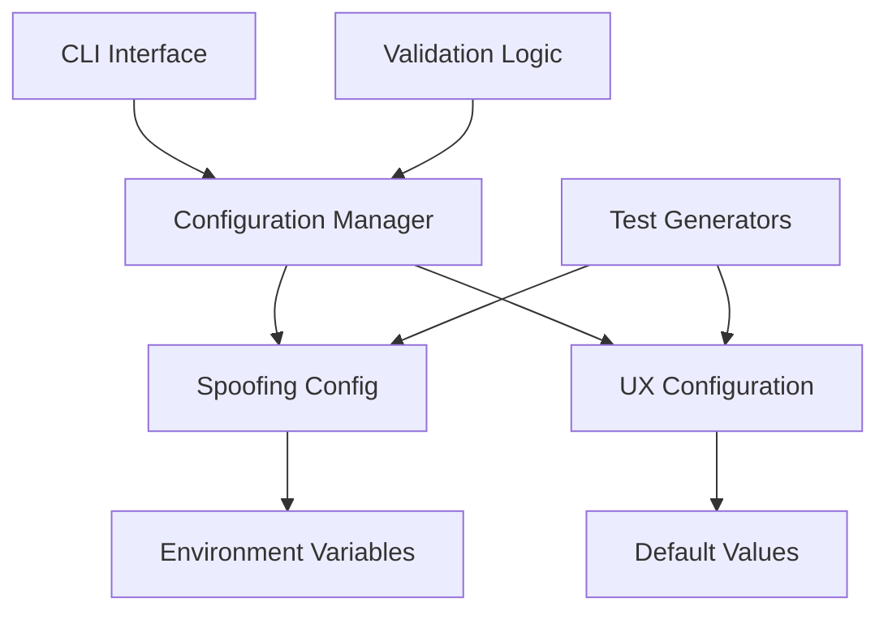

# Design Document: Reward Fee Percentage Fix

## Overview

This design addresses the incorrect reward fee percentages in the spoofing configuration system for single mode operation. The current implementation has the admin and recipient percentages set incorrectly - admin gets 0.1% (should be 0.01%) and recipient gets 99.9% (should be 99.99%). This fix focuses specifically on the single mode configuration to ensure the percentages are corrected in the core spoofing configuration files.

The solution involves updating default values in the primary configuration files while maintaining backward compatibility and ensuring validation logic works correctly with the corrected percentages for single mode operations.

## Architecture

The spoofing configuration system follows a layered architecture:



### Key Components

1. **Core Configuration Layer** (`src/config/spoofing-config.ts`)
   - Defines `SpoofingConfig` interface
   - Contains `DEFAULT_SPOOFING_CONFIG` with reward percentages for single mode
   - Manages environment variable loading for single mode operation

2. **Configuration Manager** (`SpoofingConfigManager` class)
   - Provides methods to get and update single mode configuration
   - Generates optimized reward recipients for single mode
   - Handles configuration validation for single mode percentages

## Components and Interfaces

### Configuration Interfaces

The system uses two primary interfaces for reward percentages:

```typescript
// Core spoofing configuration
interface SpoofingConfig {
  adminRewardPercentage: number;    // Will be 0.01
  recipientRewardPercentage: number; // Will be 99.99
  // ... other properties
}

// CLI UX configuration
interface SpoofingConfiguration {
  adminAllocation: number;    // Will be 0.01
  recipientAllocation: number; // Will be 99.99
  // ... other properties
}
```

### Configuration Manager

The `SpoofingConfigManager` class provides methods to:
- Get current configuration with reward percentages
- Update configuration values
- Generate optimized reward recipients with correct allocations
- Load configuration from environment variables

### Validation System

The validation system ensures:
- Individual percentages are within valid ranges
- Combined allocations sum to exactly 100%
- Floating-point precision tolerance for sum validation
- Consistency across configuration sources

## Data Models

### Reward Allocation Model

```typescript
interface RewardAllocation {
  address: string;           // Recipient address
  allocation: number;        // Percentage (0.01 or 99.99)
  rewardToken: 'Both' | 'Paired' | 'Clanker';
}
```

### Configuration Update Model

```typescript
interface ConfigurationUpdate {
  adminRewardPercentage?: number;
  recipientRewardPercentage?: number;
  // ... other optional properties
}
```

### Environment Variable Model

```typescript
interface EnvironmentConfig {
  SPOOFING_ADMIN_REWARD?: string;     // "0.01"
  SPOOFING_RECIPIENT_REWARD?: string; // "99.99"
  // ... other environment variables
}
```

## Implementation Strategy

### Phase 1: Core Configuration Updates

1. **Update Default Values in Single Mode**
   - Change `adminRewardPercentage` from 0.1 to 0.01 in `DEFAULT_SPOOFING_CONFIG`
   - Change `recipientRewardPercentage` from 99.9 to 99.99 in `DEFAULT_SPOOFING_CONFIG`
   - Update interface documentation to reflect correct single mode values

2. **Update Configuration Manager**
   - Ensure `getOptimizedRewardRecipients` returns correct percentages for single mode
   - Verify environment variable loading works with corrected single mode defaults

### Phase 2: Validation Updates

1. **Update Validation Logic**
   - Ensure validation accepts 0.01 + 99.99 = 100% for single mode
   - Maintain floating-point precision tolerance
   - Test validation with corrected single mode percentages

## Error Handling

### Validation Errors

The system handles several types of validation errors:

1. **Invalid Percentage Range**
   - Admin percentage not exactly 0.01
   - Recipient percentage not exactly 99.99

2. **Sum Validation Errors**
   - Allocations don't sum to 100% (within tolerance)
   - Floating-point precision issues

3. **Configuration Inconsistency**
   - Mismatch between adminRewardPercentage and adminAllocation
   - Mismatch between recipientRewardPercentage and recipientAllocation

### Error Recovery

- Environment variable overrides continue to work
- Configuration validation provides clear error messages
- System falls back to corrected default values
- Backward compatibility maintained for existing code

## Testing Strategy

### Unit Testing Approach

Unit tests will focus on:
- Specific configuration value validation
- Default value correctness
- Environment variable loading
- Configuration manager methods
- CLI display formatting

### Property-Based Testing Approach

Property-based tests will validate:
- Allocation sum properties (must equal 100%)
- Configuration consistency properties
- Validation logic properties
- Environment variable override properties

Each property test will run a minimum of 100 iterations to ensure comprehensive coverage.

### Test Configuration

Property-based tests will be configured with:
- **Minimum iterations**: 100 per property
- **Test tags**: Feature: reward-fee-percentage-fix, Property {number}: {description}
- **Generator constraints**: Use exact values (0.01, 99.99) and valid ranges
- **Validation properties**: Ensure mathematical correctness and business logic compliance

## Correctness Properties

*A property is a characteristic or behavior that should hold true across all valid executions of a system-essentially, a formal statement about what the system should do. Properties serve as the bridge between human-readable specifications and machine-verifiable correctness guarantees.*

Based on the prework analysis and property reflection, the following properties ensure the reward fee percentage fix is implemented correctly:

### Property 1: Single Mode Configuration Values Correctness
*For any* configuration loading from the core spoofing config, the admin percentage should be 0.01 and recipient percentage should be 99.99 for single mode operation
**Validates: Requirements 1.1, 2.1**

### Property 2: Single Mode Allocation Sum Validation
*For any* validation of single mode allocation percentages, the system should accept [0.01, 99.99] as valid (summing to 100%) and reject combinations that don't sum to 100% within floating-point tolerance
**Validates: Requirements 3.1, 3.2, 3.4**

### Property 3: Single Mode Reward Distribution Correctness
*For any* call to getOptimizedRewardRecipients in single mode, the returned allocations should sum to exactly 100% with admin allocation of 0.01 and recipient allocation of 99.99
**Validates: Requirements 3.3, 5.3**

### Property 4: Single Mode Environment Variable Support
*For any* environment variable configuration for single mode (SPOOFING_ADMIN_REWARD, SPOOFING_RECIPIENT_REWARD), the system should use corrected default values when unset and allow overrides when set
**Validates: Requirements 1.5, 2.5, 5.2**

### Property 5: Single Mode Validation Logic Acceptance
*For any* validation function in single mode, passing the corrected percentages (0.01 for admin, 99.99 for recipient) should result in successful validation
**Validates: Requirements 1.4, 2.4, 5.5**

### Property 6: Single Mode Backward Compatibility
*For any* existing single mode configuration loading mechanism, the system should continue to work correctly with the new percentage values without breaking functionality
**Validates: Requirements 5.4, 5.5**

## Testing Strategy

### Dual Testing Approach

The testing strategy employs both unit tests and property-based tests to ensure comprehensive coverage:

**Unit Tests** focus on:
- Specific default value verification (DEFAULT_SPOOFING_CONFIGURATION values)
- Exact constant validation (strategy descriptions and default objects)
- Edge cases in validation logic
- CLI display formatting with specific inputs
- Environment variable loading scenarios

**Property Tests** focus on:
- Universal properties that hold across all configuration sources
- Mathematical correctness of allocation sums
- Consistency properties across different interfaces
- Validation behavior across input ranges
- Display formatting across various configuration states

### Property-Based Testing Configuration

Property-based tests will be configured with:
- **Minimum 100 iterations** per property test to ensure comprehensive input coverage
- **Test library**: Use fast-check for TypeScript property-based testing
- **Tag format**: **Feature: reward-fee-percentage-fix, Property {number}: {property_text}**
- **Generator constraints**: 
  - Use exact values (0.01, 99.99) for positive test cases
  - Generate invalid allocation pairs for negative test cases
  - Create various configuration source combinations
  - Generate different CLI display scenarios

### Unit Testing Balance

Unit tests complement property tests by:
- Testing specific examples that demonstrate correct behavior
- Validating integration points between configuration layers
- Testing error conditions and edge cases not covered by properties
- Verifying specific constant values and default configurations

Property tests handle comprehensive input coverage through randomization, while unit tests focus on specific scenarios and exact value verification.

Each property test references its corresponding design document property and validates the universal correctness guarantees across all valid system executions.