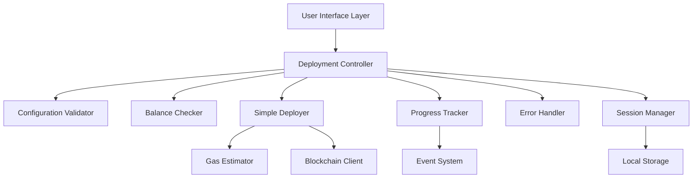

# Design Document: Simplified Batch Deployment System

## Overview

The simplified batch deployment system replaces the complex multi-layered architecture with a streamlined, user-focused design. The system prioritizes ease of use, error prevention, and clear feedback while maintaining the core functionality of deploying multiple tokens efficiently.

The design eliminates the complex `MultiWalletBatchManager` and template-heavy approach in favor of a direct deployment model with intelligent defaults and proactive validation.

## Architecture

The system follows a layered architecture with clear separation of concerns:



### Core Principles

1. **Single Responsibility**: Each component has one clear purpose
2. **Fail Fast**: Validate everything before starting deployment
3. **Progressive Disclosure**: Show simple options first, advanced options on demand
4. **Graceful Degradation**: Continue deployment even if individual tokens fail
5. **State Persistence**: Maintain deployment state across interruptions

## Components and Interfaces

### 1. Deployment Controller

The central orchestrator that coordinates all deployment activities.

```typescript
interface DeploymentController {
  // Configuration management
  setTokenConfigs(configs: TokenConfig[]): ValidationResult
  getTokenConfigs(): TokenConfig[]
  
  // Deployment lifecycle
  validateDeployment(): Promise<ValidationResult>
  startDeployment(): Promise<DeploymentSession>
  pauseDeployment(): Promise<void>
  resumeDeployment(): Promise<void>
  cancelDeployment(): Promise<void>
  
  // Event handling
  onProgress(callback: (progress: DeploymentProgress) => void): void
  onError(callback: (error: DeploymentError) => void): void
  onComplete(callback: (result: DeploymentResult) => void): void
}
```

### 2. Configuration Validator

Validates token configurations and deployment settings in real-time.

```typescript
interface ConfigurationValidator {
  validateTokenConfig(config: TokenConfig): ValidationResult
  validateBatchConfig(configs: TokenConfig[]): ValidationResult
  checkDuplicates(configs: TokenConfig[]): DuplicateCheckResult
  validateSupplyRange(supply: string): ValidationResult
}

interface TokenConfig {
  name: string
  symbol: string
  initialSupply: string
  decimals?: number // defaults to 18
  advanced?: AdvancedTokenConfig
}

interface AdvancedTokenConfig {
  mintable?: boolean
  burnable?: boolean
  pausable?: boolean
  customGasLimit?: number
}
```

### 3. Balance Checker

Proactively validates wallet balance and estimates deployment costs.

```typescript
interface BalanceChecker {
  checkBalance(walletAddress: string): Promise<BalanceInfo>
  estimateDeploymentCost(configs: TokenConfig[]): Promise<CostEstimate>
  validateSufficientFunds(walletAddress: string, configs: TokenConfig[]): Promise<FundsValidation>
}

interface BalanceInfo {
  currentBalance: string
  balanceInEth: string
  lastUpdated: Date
}

interface CostEstimate {
  totalGasCost: string
  perTokenCost: string
  safetyBuffer: string
  estimatedTotal: string
}

interface FundsValidation {
  sufficient: boolean
  currentBalance: string
  requiredAmount: string
  shortfall?: string
  recommendation?: string
}
```

### 4. Simple Deployer

Handles the actual token deployment process with automatic nonce and gas management.

```typescript
interface SimpleDeployer {
  deploy(configs: TokenConfig[], options: DeploymentOptions): Promise<DeploymentResult>
  deployToken(config: TokenConfig, nonce: number): Promise<TokenDeploymentResult>
  estimateGas(config: TokenConfig): Promise<GasEstimate>
}

interface DeploymentOptions {
  walletAddress: string
  gasStrategy: 'conservative' | 'standard' | 'fast'
  maxConcurrency?: number // defaults to 1 for single wallet
  retryAttempts?: number // defaults to 3
}

interface TokenDeploymentResult {
  success: boolean
  tokenAddress?: string
  transactionHash?: string
  gasUsed?: string
  error?: DeploymentError
  timestamp: Date
}
```

### 5. Progress Tracker

Provides real-time feedback on deployment progress.

```typescript
interface ProgressTracker {
  startTracking(totalTokens: number): void
  updateProgress(completed: number, current: string): void
  recordSuccess(result: TokenDeploymentResult): void
  recordFailure(error: DeploymentError): void
  getProgress(): DeploymentProgress
  estimateTimeRemaining(): number
}

interface DeploymentProgress {
  totalTokens: number
  completedTokens: number
  currentToken: string
  successCount: number
  failureCount: number
  estimatedTimeRemaining: number
  averageDeploymentTime: number
}
```

### 6. Error Handler

Manages error scenarios with clear, actionable messages.

```typescript
interface ErrorHandler {
  handleError(error: Error, context: DeploymentContext): DeploymentError
  categorizeError(error: Error): ErrorCategory
  getRecoveryAction(error: DeploymentError): RecoveryAction
  shouldRetry(error: DeploymentError): boolean
}

interface DeploymentError {
  category: ErrorCategory
  message: string
  technicalDetails: string
  recoveryAction: RecoveryAction
  retryable: boolean
  timestamp: Date
}

type ErrorCategory = 
  | 'insufficient_funds'
  | 'network_error'
  | 'configuration_error'
  | 'contract_error'
  | 'gas_estimation_error'

interface RecoveryAction {
  action: string
  description: string
  automated: boolean
}
```

### 7. Session Manager

Manages deployment session state and persistence.

```typescript
interface SessionManager {
  createSession(configs: TokenConfig[]): DeploymentSession
  saveSession(session: DeploymentSession): Promise<void>
  loadSession(sessionId: string): Promise<DeploymentSession>
  pauseSession(sessionId: string): Promise<void>
  resumeSession(sessionId: string): Promise<void>
  getSessionHistory(): Promise<DeploymentSession[]>
}

interface DeploymentSession {
  id: string
  status: SessionStatus
  configs: TokenConfig[]
  results: TokenDeploymentResult[]
  startTime: Date
  endTime?: Date
  totalCost: string
  walletAddress: string
}

type SessionStatus = 'pending' | 'running' | 'paused' | 'completed' | 'cancelled' | 'failed'
```

## Data Models

### Core Data Structures

```typescript
// Minimal token configuration
interface TokenConfig {
  name: string           // Required: Token name
  symbol: string         // Required: Token symbol  
  initialSupply: string  // Required: Initial supply as string to handle large numbers
  decimals: number       // Optional: defaults to 18
  advanced?: {           // Optional advanced settings
    mintable?: boolean
    burnable?: boolean
    pausable?: boolean
    customGasLimit?: number
  }
}

// Deployment session state
interface DeploymentSession {
  id: string
  status: SessionStatus
  configs: TokenConfig[]
  results: TokenDeploymentResult[]
  progress: DeploymentProgress
  startTime: Date
  endTime?: Date
  totalCost: string
  walletAddress: string
  gasStrategy: string
}

// Historical deployment record
interface DeploymentHistory {
  sessions: DeploymentSession[]
  totalDeployments: number
  totalCost: string
  successRate: number
  lastDeployment: Date
}
```

## Correctness Properties

*A property is a characteristic or behavior that should hold true across all valid executions of a system—essentially, a formal statement about what the system should do. Properties serve as the bridge between human-readable specifications and machine-verifiable correctness guarantees.*

<function_calls>
<invoke name="prework">
<parameter name="featureName">simplified-batch-deployment

### Property Reflection

After analyzing all acceptance criteria, I identified several areas where properties can be consolidated:

**Consolidation Opportunities:**
- Properties 3.2, 3.4 can be combined into a comprehensive balance display property
- Properties 5.1, 5.3, 5.4, 5.5 can be combined into a comprehensive progress tracking property  
- Properties 9.1, 9.3, 9.5 can be combined into a comprehensive real-time validation property
- Properties 10.1, 10.2, 10.4 can be combined into a comprehensive history management property

**Unique Properties Retained:**
- Configuration step limits (1.1)
- Essential field validation (1.2) 
- Default value provision (1.4)
- Template-free deployment (1.5, 6.1)
- Nonce management (2.2)
- Sequential deployment (2.4)
- State preservation (2.5, 8.2, 8.4)
- Balance validation timing (3.1)
- Cost calculation components (3.3)
- Deployment prevention (3.5)
- Retry behavior (4.2)
- Partial success handling (4.3)
- Error categorization (4.4)
- Resume functionality (4.5, 8.3)
- Time estimation (5.2)
- Import format support (6.3)
- History independence (6.4)
- Template format (6.5)
- Gas estimation (7.1, 7.4)
- Dynamic gas adjustment (7.2)
- Gas buffer calculation (7.3)
- Cost display timing (7.5)
- Graceful cancellation (8.5)
- Duplicate detection (9.2)
- Supply validation (9.4)
- Cost calculation across sessions (10.5)

### Correctness Properties

Property 1: Configuration step limit
*For any* batch deployment workflow, the number of required configuration steps should not exceed 4
**Validates: Requirements 1.1**

Property 2: Essential field validation
*For any* token configuration, validation should succeed when only name, symbol, and initial supply are provided
**Validates: Requirements 1.2**

Property 3: Default value provision
*For any* token configuration with missing optional fields, the system should provide sensible default values
**Validates: Requirements 1.4**

Property 4: Template-free deployment capability
*For any* valid token configuration set, deployment should succeed without requiring template file generation
**Validates: Requirements 1.5, 6.1**

Property 5: Automatic nonce management
*For any* sequence of token deployments from a single wallet, nonce values should increment correctly without manual intervention
**Validates: Requirements 2.2**

Property 6: Sequential deployment ordering
*For any* batch deployment from a single wallet, tokens should be deployed in the specified order using the same wallet address
**Validates: Requirements 2.4**

Property 7: Configuration state preservation
*For any* deployment mode change or session pause/resume, existing token configurations should remain unchanged
**Validates: Requirements 2.5, 8.2, 8.4**

Property 8: Pre-deployment balance validation
*For any* deployment initiation, balance validation should occur before any deployment transactions are sent
**Validates: Requirements 3.1**

Property 9: Comprehensive balance information display
*For any* balance check result, the system should display current balance, required amount, and shortfall (if insufficient) or remaining balance (if sufficient)
**Validates: Requirements 3.2, 3.4**

Property 10: Complete cost calculation
*For any* deployment cost estimate, the calculation should include gas fees, deployment costs, and safety buffer
**Validates: Requirements 3.3**

Property 11: Insufficient funds prevention
*For any* wallet with insufficient balance, deployment initiation should be prevented
**Validates: Requirements 3.5**

Property 12: Exponential backoff retry
*For any* network error during deployment, retry attempts should follow exponential backoff timing patterns
**Validates: Requirements 4.2**

Property 13: Partial success continuation
*For any* batch deployment where individual tokens fail, the system should continue processing remaining tokens and report partial success
**Validates: Requirements 4.3**

Property 14: Error categorization
*For any* deployment error, the system should correctly categorize it as insufficient funds, network issues, configuration errors, or contract failures
**Validates: Requirements 4.4**

Property 15: Resume from last success point
*For any* paused or failed deployment session, resumption should continue from the last successfully deployed token
**Validates: Requirements 4.5, 8.3**

Property 16: Comprehensive progress tracking
*For any* active deployment, the system should display current token, overall progress, transaction hashes, gas costs, and final summary
**Validates: Requirements 5.1, 5.3, 5.4, 5.5**

Property 17: Time estimation accuracy
*For any* deployment in progress, estimated time remaining should be based on current deployment speed and be reasonably accurate
**Validates: Requirements 5.2**

Property 18: Import format support
*For any* valid CSV or JSON configuration file, the system should successfully import token configurations
**Validates: Requirements 6.3**

Property 19: History independence from templates
*For any* deployment session, history should be maintained regardless of whether template files were used
**Validates: Requirements 6.4**

Property 20: Simplified template format
*For any* generated template file, it should contain only essential fields (name, symbol, initial supply) plus optional advanced settings
**Validates: Requirements 6.5**

Property 21: Network-based gas estimation
*For any* gas price estimation, the system should use current network conditions to determine appropriate gas prices
**Validates: Requirements 7.1**

Property 22: Dynamic gas price adjustment
*For any* deployment session where gas prices change, estimates for remaining deployments should be updated accordingly
**Validates: Requirements 7.2**

Property 23: Conservative gas buffer
*For any* deployment transaction, the gas limit should include a 20% buffer above the estimated requirement
**Validates: Requirements 7.3**

Property 24: Fallback gas estimation
*For any* failed gas estimation attempt, the system should use fallback values based on historical deployment data
**Validates: Requirements 7.4**

Property 25: Gas cost display timing
*For any* deployment, gas cost estimates should be shown before deployment starts and actual costs should be shown after completion
**Validates: Requirements 7.5**

Property 26: Graceful cancellation
*For any* deployment cancellation request, the current token deployment should complete before the session stops
**Validates: Requirements 8.5**

Property 27: Real-time input validation
*For any* token configuration input, validation should occur immediately and provide instant feedback on validity
**Validates: Requirements 9.1, 9.3, 9.5**

Property 28: Duplicate detection
*For any* batch configuration, the system should detect and flag duplicate token names or symbols within the same batch
**Validates: Requirements 9.2**

Property 29: Supply range validation
*For any* initial supply value, the system should validate that it falls within acceptable ranges for token creation
**Validates: Requirements 9.4**

Property 30: Comprehensive history management
*For any* deployment session, the system should record timestamps, outcomes, token details, transaction hashes, gas costs, and failure information
**Validates: Requirements 10.1, 10.2, 10.4**

Property 31: Cross-session cost calculation
*For any* set of deployment sessions, the system should accurately calculate and display total deployment costs across all sessions
**Validates: Requirements 10.5**

## Error Handling

The error handling strategy focuses on prevention, clear communication, and graceful recovery:

### Error Prevention
- **Proactive Validation**: Validate all inputs before deployment starts
- **Balance Checking**: Ensure sufficient funds before any transactions
- **Network Monitoring**: Check network conditions and adjust gas prices
- **Configuration Validation**: Real-time validation of all token configurations

### Error Categories and Responses

1. **Insufficient Funds Errors**
   - Display exact shortfall amount
   - Show current balance and required amount
   - Suggest specific actions (add funds, reduce batch size)
   - Prevent deployment initiation

2. **Network Errors**
   - Automatic retry with exponential backoff
   - Maximum 3 retry attempts per transaction
   - Clear indication of network issues to user
   - Option to pause and resume when network improves

3. **Configuration Errors**
   - Real-time validation with immediate feedback
   - Specific error messages for each field
   - Suggestions for valid values
   - Prevention of deployment with invalid configurations

4. **Contract Deployment Errors**
   - Continue with remaining tokens in batch
   - Record specific failure reason
   - Provide transaction hash for failed attempts
   - Option to retry individual failed deployments

### Recovery Mechanisms
- **Session Persistence**: Save state across application restarts
- **Resume Capability**: Continue from last successful deployment
- **Partial Success Handling**: Complete successful deployments even if some fail
- **Manual Retry**: Allow users to retry failed deployments individually

## Testing Strategy

The testing approach combines unit tests for specific scenarios with property-based tests for comprehensive validation:

### Unit Testing Focus
- **Configuration Validation**: Test specific validation rules and edge cases
- **Error Scenarios**: Test specific error conditions and recovery actions
- **UI State Management**: Test component state changes and user interactions
- **Integration Points**: Test interactions between components

### Property-Based Testing Configuration
- **Library**: Use `fast-check` for TypeScript/JavaScript implementation
- **Iterations**: Minimum 100 iterations per property test
- **Test Tagging**: Each property test tagged with format: **Feature: simplified-batch-deployment, Property {number}: {property_text}**

### Property Test Implementation
Each correctness property will be implemented as a separate property-based test:

```typescript
// Example property test structure
describe('Simplified Batch Deployment Properties', () => {
  it('Property 2: Essential field validation', () => {
    fc.assert(fc.property(
      fc.record({
        name: fc.string({ minLength: 1 }),
        symbol: fc.string({ minLength: 1 }),
        initialSupply: fc.string({ minLength: 1 })
      }),
      (config) => {
        const result = validator.validateTokenConfig(config);
        expect(result.valid).toBe(true);
      }
    ), { numRuns: 100 });
  });
  // Tag: Feature: simplified-batch-deployment, Property 2: Essential field validation
});
```

### Test Coverage Requirements
- **Unit Tests**: Cover specific examples, edge cases, and error conditions
- **Property Tests**: Verify universal properties across all valid inputs
- **Integration Tests**: Test complete deployment workflows
- **Performance Tests**: Validate deployment speed and resource usage

### Continuous Testing
- **Pre-deployment Validation**: Run all tests before each deployment
- **Regression Testing**: Ensure new changes don't break existing functionality
- **User Acceptance Testing**: Validate simplified user experience meets requirements