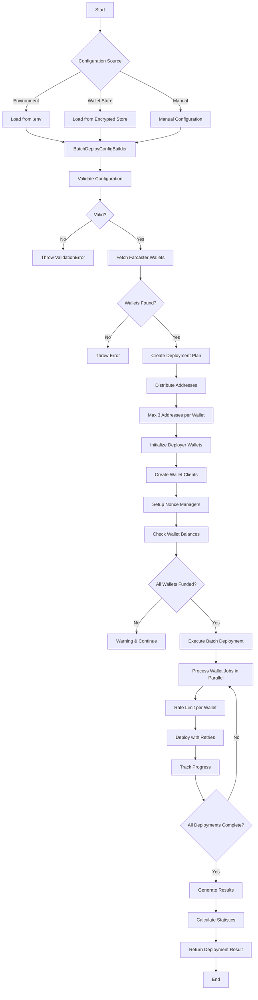
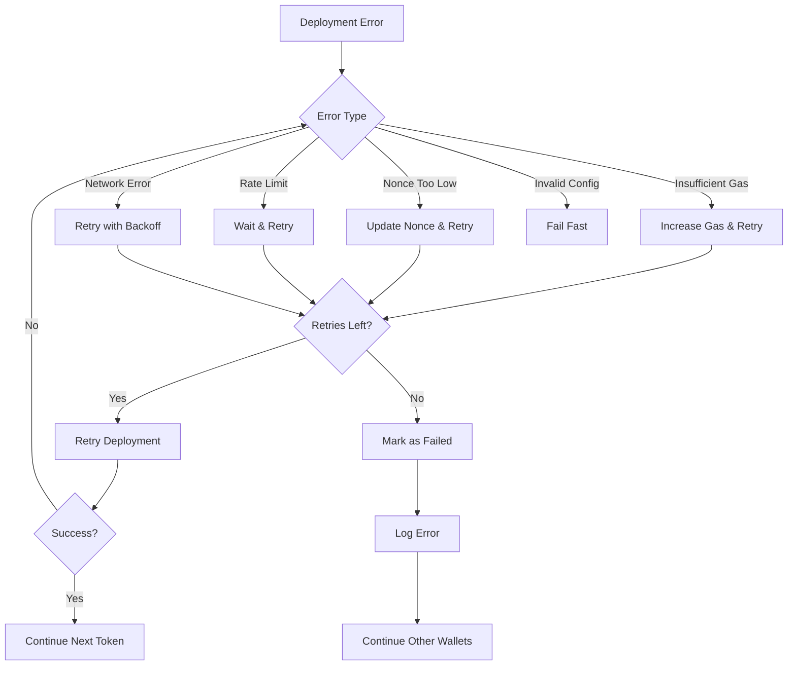

# Multi-Wallet Batch Deployment Flow

## Overview
The multi-wallet batch deployment system enables deploying multiple tokens simultaneously using multiple deployer wallets, with intelligent distribution and optimization features.

## Architecture Flow



## Detailed Flow Steps

### 1. Configuration Phase
```typescript
// Three ways to configure:
// 1. From environment variables
const config = MultiWalletBatchManager.createFromEnv(tokenConfigs);

// 2. From encrypted wallet store
const config = await MultiWalletBatchManager.createFromWalletStore(
  tokenConfigs,
  password,
  walletCount
);

// 3. Manual configuration with builder
const config = new BatchDeployConfigBuilder()
  .farcasterInput('username')
  .deployerPrivateKeys('key1,key2,key3')
  .strategy('balanced')
  .build();
```

### 2. Validation Phase
- Validate Farcaster input (username/FID)
- Validate token configurations
- Validate private key formats
- Check strategy parameters
- Validate deployment limits

### 3. Wallet Discovery Phase
```typescript
// Fetch wallets from Farcaster
const walletsResult = await getUserWallets(config.farcasterInput);
// Returns: custodyAddress + connected ETH wallets
```

### 4. Distribution Planning Phase
```typescript
// Distribute token deployments across deployer wallets
const plan = {
  totalTokens: 15,
  deployerWallets: 5,
  tokensPerWallet: 3,
  addressDistribution: Map {
    "0xdeployer1" => ["0xaddress1", "0xaddress2", "0xaddress3"],
    "0xdeployer2" => ["0xaddress4", "0xaddress5", "0xaddress6"],
    // ... max 3 addresses per deployer
  }
};
```

### 5. Wallet Initialization Phase
- Create wallet clients for each deployer
- Initialize nonce managers for parallel deployments
- Check wallet balances (warn if < 0.01 ETH)
- Set up rate limiting per wallet

### 6. Deployment Execution Phase
```typescript
// Parallel deployment with controls
for each deployer wallet:
  - Process assigned tokens sequentially
  - Respect rate limits (default: 1 req/s)
  - Retry on failure (default: 3 retries)
  - Track progress with callbacks
```

### 7. Results Aggregation Phase
- Collect deployment results from all wallets
- Calculate success rates per wallet
- Aggregate gas usage statistics
- Generate deployment report

## Configuration Options

### Strategy Presets
```typescript
// Conservative - Slow but reliable
{
  deployDelay: 3000,      // 3 seconds between deploys
  maxConcurrentPerWallet: 1,
  rateLimitPerWallet: 1,  // 1 request per second
  maxRetries: 5,
  gasMultiplier: 1.2
}

// Balanced - Default option
{
  deployDelay: 1000,      // 1 second between deploys
  maxConcurrentPerWallet: 1,
  rateLimitPerWallet: 2,  // 2 requests per second
  maxRetries: 3,
  gasMultiplier: 1.1
}

// Aggressive - Fast deployment
{
  deployDelay: 500,       // 0.5 seconds between deploys
  maxConcurrentPerWallet: 2,
  rateLimitPerWallet: 5,  // 5 requests per second
  maxRetries: 2,
  gasMultiplier: 1.05
}
```

## Error Handling Flow



## Usage Examples

### Basic Usage
```typescript
const batchManager = new MultiWalletBatchManager(publicClient, base);

// Quick deployment with automatic setup
const result = await batchManager.executeBatchDeploymentWithSetup(config, (progress) => {
  console.log(`Progress: ${progress.completed}/${progress.total}`);
  console.log(`Current: ${progress.currentToken}`);
  console.log(`Wallet: ${progress.currentWallet}`);
});
```

### Advanced Usage with Custom Options
```typescript
const config = {
  farcasterInput: 'vitalik',
  tokenConfigs: tokens,
  deployerPrivateKeys: keys,
  maxAddressesPerDeployer: 3,
  deployOptions: {
    maxConcurrentPerWallet: 2,
    deployDelay: 1000,
    maxRetries: 3,
    gasMultiplier: 1.1
  }
};

// Step-by-step execution
const { plan, isReady } = await batchManager.setupBatchDeployer(config);
if (isReady) {
  const result = await batchManager.executeBatchDeployment(config, onProgress);
}
```

## Security Considerations

1. **Private Key Management**
   - Support for encrypted wallet storage
   - Mnemonic-based HD wallet derivation
   - Never log private keys

2. **Rate Limiting**
   - Per-wallet rate limits to avoid RPC throttling
   - Configurable delays between deployments

3. **Error Boundaries**
   - Isolated failures per wallet
   - Continue deployment even if some wallets fail

## Performance Optimization

1. **Parallel Processing**
   - Multiple wallets work in parallel
   - Configurable concurrency per wallet

2. **Gas Optimization**
   - Dynamic gas price adjustment
   - Gas multiplier for faster inclusion

3. **Batch Distribution**
   - Intelligent load balancing
   - Maximum 3 addresses per deployer for optimal performance

## Monitoring & Debugging

1. **Progress Tracking**
   - Real-time deployment progress
   - Per-wallet status updates

2. **Statistics**
   - Success rate per wallet
   - Gas usage tracking
   - Deployment time metrics

3. **Logging**
   - Structured error logging
   - Performance metrics
   - Audit trail for deployments
